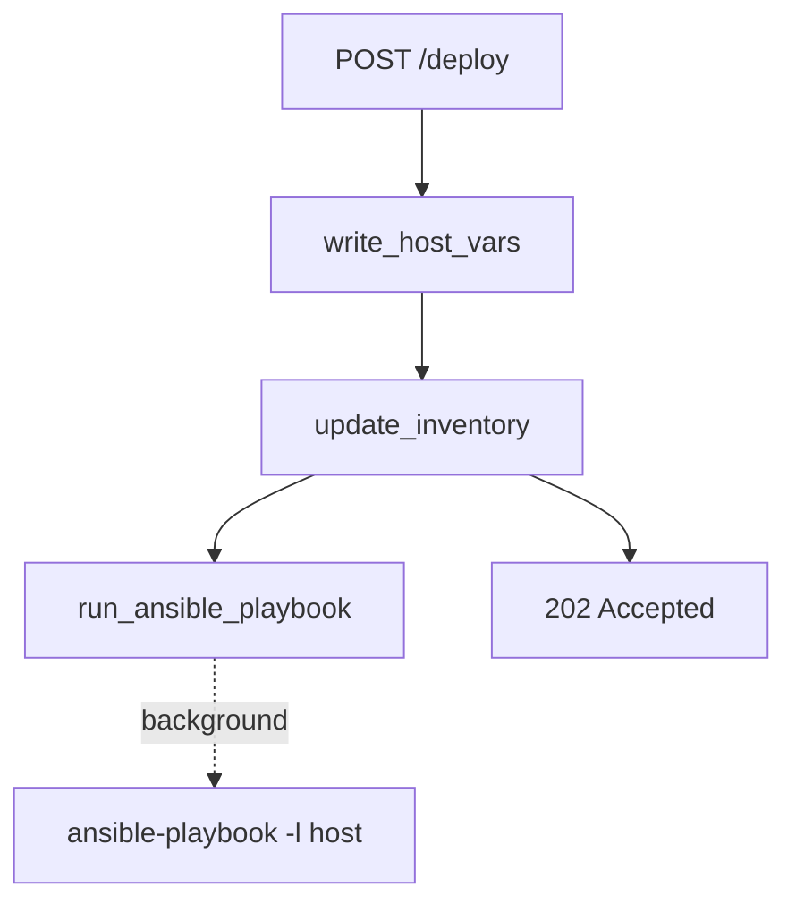

# Рефакторинг daemon/main.py

## Цель

[`daemon/readme.md`](../readme.md) уже содержит полное описание архитектуры, алгоритмов и примеров `curl`. [`daemon/main.py`](../main.py) сейчас дублирует эту информацию в русских комментариях и многословных docstring'ах — это противоречит правилу «код в основном самодокументируемый, комментарии только для неочевидной логики».

Рефакторинг **не меняет поведение** API: те же Pydantic-модели, те же файлы (`main.yml`, `node-exporter.yml`), та же логика `[test_hosts]` в инвентаре, тот же фоновый `ansible-playbook -l`.

## Что изменить в main.py

### 1. Заголовок и импорты

- Убрать строку `# daemon/main.py`.
- Добавить краткий module docstring (1–2 строки) со ссылкой на [`daemon/readme.md`](../readme.md) для полной документации.
- Удалить неиспользуемые `Dict`, `Any` из `typing`.
- Упорядочить импорты: stdlib → third-party (как в [`tools/ci-script.py`](../../tools/ci-script.py)).

### 2. Константы

Вынести магическую строку группы инвентаря:

```python
INVENTORY_GROUP = "test_hosts"
```

Использовать её в `update_inventory` вместо повторяющегося `"test_hosts"` в regex и f-string.

### 3. Pydantic-модели

Оставить структуру без изменений. Перевести `Field(..., description=...)` на английский — в репозитории Python-код и docstring'и на английском ([`tools/export_hostvars_to_yaml.py`](../../tools/export_hostvars_to_yaml.py), [`tools/ci-script.py`](../../tools/ci-script.py)).

### 4. Убрать избыточные комментарии и docstring'и

Удалить:
- `# Пути относительно корня проекта Ansible`
- `# Создаем папку для логов...`
- `# Описание схем данных API`
- нумерованные шаги `# 1. Записываем...` в endpoint
- пошаговые комментарии внутри `update_inventory` / `write_host_vars` / `run_ansible_playbook`

Docstring'и функций сократить до одной строки на английском **только там, где имя функции недостаточно** (например, `update_inventory` — идемпотентное обновление группы `[test_hosts]`).

### 5. Небольшой DRY без over-engineering

Дублируется запись YAML с префиксом `---\n`:

```python
def _write_yaml(path: str, data: dict) -> None:
    with open(path, "w", encoding="utf-8") as f:
        f.write("---\n")
        yaml.safe_dump(data, f, default_flow_style=False, allow_unicode=True)
```

Использовать в `write_host_vars` для `main.yml` и `node-exporter.yml`.

### 6. Мелкие улучшения читаемости

- `open(..., encoding="utf-8")` для всех файловых операций.
- Явные type hints на аргументах/возврате публичных функций (`-> None`, `-> dict`).
- В `deploy_node_exporter` убрать try/except с широким `Exception` вокруг всего тела — оставить только там, где это оправдано readme (ошибки I/O при подготовке файлов → `500`). Либо сузить до `OSError` / `FileNotFoundError`, не ловя неожиданные баги.

### 7. Что **не** делать (minimize scope)

- Не разбивать на пакет `daemon/models.py`, `daemon/inventory.py` и т.д.
- Не менять [`daemon/readme.md`](../readme.md) — он остаётся источником подробной документации.
- Не добавлять тесты.
- Не менять API-контракт, пути, дефолты Pydantic, playbook path.

## Итоговая структура файла

```
module docstring → imports → constants → app → models → helpers → endpoint
```



## Проверка

1. `python -m py_compile daemon/main.py` — синтаксис валиден.
2. `make prepare` + импорт `from main import app` через `--app-dir daemon` — приложение загружается.
3. Swagger `/docs` показывает те же поля и дефолты.
4. Поведение `update_inventory` / `write_host_vars` логически идентично readme (без изменения regex и структуры YAML).

## Затрагиваемые файлы

| Файл | Действие |
|------|----------|
| [`daemon/main.py`](../main.py) | Рефакторинг стиля и структуры |
