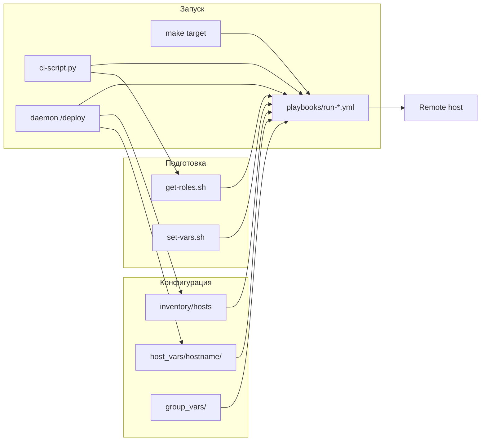

# Поток деплоя

Типичный путь от конфигурации до применения на сервере.



## 1. Описать хост

1. Добавить запись в [`inventory/hosts`](../inventory/hosts) (группы и `ansible_host` / `ansible_ip`).
2. Создать каталог `host_vars/<hostname>/` с YAML-файлами сервисов, например `traefik.yml`, `docker.yml`.
3. При необходимости — переменные в `group_vars/<group>/`.

Имена файлов в `host_vars/` обычно совпадают с именами файлов в `tools/roles_lists/` (без пути): `traefik.yml` → `tools/roles_lists/traefik.yml`.

## 2. Подготовить окружение

```bash
make prepare                    # .venv, poetry, зависимости демона
. ./tools/set-vars.sh           # ANSIBLE_BECOME_PASS, vault, mitogen
./tools/get-roles.sh traefik    # роли в ./roles/
```

## 3. Запустить плейбук

**Напрямую:**

```bash
./playbooks/services/run-traefik.yml -l myhost.example.com
```

**Через Make** (если есть таргет):

```bash
HOST=myhost.example.com make traefik
```

**Composite-стек** (несколько плейбуков подряд):

```bash
./playbooks/run-minimal-full.yml -l myhost.example.com
./playbooks/run-minimal-full.yml -l myhost --tags common
```

## 4. Альтернативные точки входа

| Способ | Когда использовать |
|--------|-------------------|
| `make <target>` | Частые деплои с выбором хоста через `HOST` или fzf |
| `ci-script.py --preview` | GitLab CI / PR: diff vars → список ansible-команд |
| `make daemon` + `POST /deploy` | Автоматический провижининг VM (node-exporter) |

## Связь host_vars и Ansible groups

Плейбук указывает `hosts: traefik` — в inventory хост должен входить в группу `traefik` (или эквивалентную), а переменные роли — в `host_vars/<hostname>/traefik.yml`.

Проверить список хостов с метаданными:

```bash
./tools/nodes_list.sh
```

## Дальше

- [getting-started.md](../guides/getting-started.md) — пошаговый первый деплой
- [running-playbooks.md](../guides/running-playbooks.md) — теги, лимиты, shebang
- [roles-lists.md](../reference/roles-lists.md) — установка ролей
